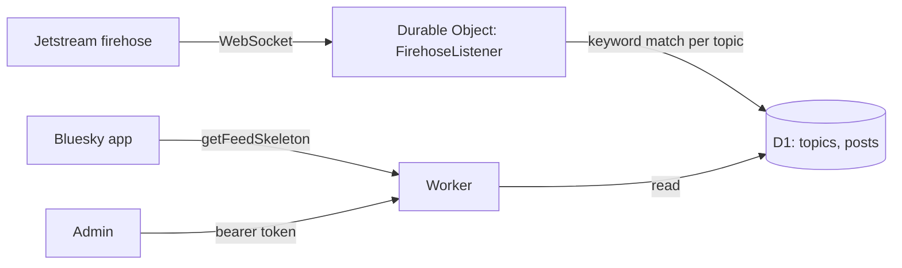

# atproto-feedgen

An AT Protocol feed generator for Bluesky, running entirely on Cloudflare Workers. Topics are managed dynamically via REST API without redeploying; a persistent Durable Object streams [Jetstream](https://github.com/bluesky-social/jetstream) (Bluesky's JSON firehose) and matches posts against per-topic keyword lists in real time. First topic: options/futures trading talk.

## Development Approach

This project exemplifies disciplined software engineering: requirements and architecture were specified in detail *before* code was written, the application was developed test-driven (keyword matching and feed logic verified with unit tests alongside implementation), and all functionality was validated end-to-end before deployment. This approach demonstrates how structured practices—spec first, verify continuously, test as you build—compress what traditionally takes weeks of scaffolding and plumbing Cloudflare and AT Protocol primitives into focused, high-confidence delivery.

**Highlights:**
- Spec-first architecture defined and approved before implementation
- Test-driven development (unit tests for the keyword-matching logic)
- End-to-end verification before shipping
- Multi-topic by design: new feeds are a config change, not a redeploy

## How it works



- A Durable Object holds a persistent connection to [Jetstream](https://github.com/bluesky-social/jetstream)
  (Bluesky's lightweight JSON firehose), tests each post against every topic's keyword list, and
  stores matches in D1.
- The Worker serves the standard feed generator XRPC endpoints (`describeFeedGenerator`,
  `getFeedSkeleton`) plus an admin API for managing topics.
- Topics live in D1 — adding one is an API call, not a deploy. Publishing the corresponding
  `app.bsky.feed.generator` record to a real Bluesky account (a separate one-time step, see below)
  is what makes it show up in the Bluesky app.

## Setup

```bash
npm install
wrangler d1 create atproto-feedgen-db   # paste the resulting database_id into wrangler.toml
npm run migrate:local                    # or migrate:remote after first deploy
wrangler secret put ADMIN_TOKEN
npm run dev
```

Set `FEEDGEN_HOSTNAME` and `FEEDGEN_PUBLISHER_DID` in `wrangler.toml` once you know your custom
domain and the DID of the Bluesky account that will own the feed generator records.

## Adding a topic

```bash
curl -X POST https://<host>/admin/topics \
  -H "Authorization: Bearer $ADMIN_TOKEN" \
  -H "Content-Type: application/json" \
  -d '{"rkey":"options-futures","displayName":"Options & Futures Talk","keywords":["options","futures","theta","/es","/nq"],"excludeKeywords":["nfl futures"]}'
```

Then publish the generator record once so Bluesky's directory picks it up:

```bash
BSKY_HANDLE=you.bsky.social BSKY_APP_PASSWORD=xxxx-xxxx-xxxx-xxxx FEEDGEN_HOSTNAME=<host> \
  npm run publish-feed -- options-futures "Options & Futures Talk" "Options and futures trading discussion on Bluesky."
```

## Test

```bash
npm test
```
